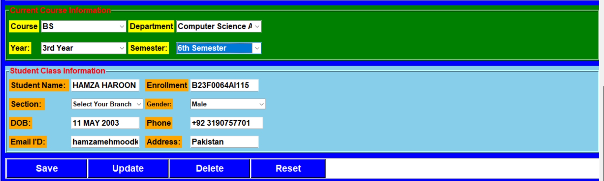
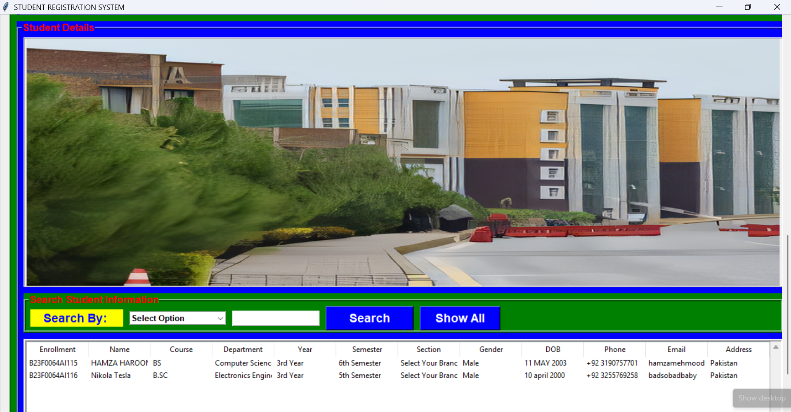

# 🎓 Student Registration System (Python + Tkinter + MySQL)

A **fully functional desktop-based Student Registration System** built using **Python (Tkinter GUI)** and **MySQL database**.  
This application allows users to **add, update, delete, search, and manage student records efficiently** with an interactive graphical interface.

---

## 📌 Project Overview

This system is designed to simplify student data management in educational institutions.  
It provides a **user-friendly interface** and ensures smooth database operations.

---

## ✨ Features

✅ Add new student records  
✅ Update existing student details  
✅ Delete student records  
✅ Search students by:
- Enrollment
- Name
- Phone  

✅ View all student records in a table  
✅ Scrollable modern GUI  
✅ Responsive full-screen layout  
✅ MySQL database integration  

---

## 🖼️ Project Preview

### 🔹 Main UI


### 🔹 Student Registration Form


### 🔹 Database View


---

## 🏗️ Tech Stack

- **Frontend:** Tkinter (Python GUI)
- **Backend:** Python
- **Database:** MySQL
- **Libraries Used:**
  - tkinter
  - ttk
  - PIL (Pillow)
  - mysql-connector-python

---

## 📂 Project Structure

```bash
student-registration-system/
│── assets/
│   ├── UI.png
│   ├── register.png
│   ├── database.png
│
│── college_images/
│   ├── mits.png
│   ├── university.png
│   ├── 5th.jpeg
│
│── main.py
│── requirements.txt
│── README.md
```

## ⚙️ Installation & Setup

### 🔹 1. Clone Repository
```bash
git clone https://github.com/hamzamehmoodkhan1245/Student-Registration-System.git
cd Student-Registration-System

2. Install Dependencies
pip install -r requirements.txt

3. Setup MySQL Database

Open MySQL and run:
CREATE DATABASE student_management_system;

USE student_management_system;

CREATE TABLE student (
    Enrollment VARCHAR(50) PRIMARY KEY,
    Name VARCHAR(100),
    Course VARCHAR(50),
    Department VARCHAR(100),
    Year VARCHAR(50),
    Semester VARCHAR(50),
    Section VARCHAR(50),
    Gender VARCHAR(20),
    DOB VARCHAR(50),
    Phone VARCHAR(20),
    Email VARCHAR(100),
    Address VARCHAR(255)
);

🔹 4. Update Database Credentials
host="localhost"
username="root"
password="YOUR_PASSWORD"
database="student_management_system"

🔹 5. Run the Application
python main.py

🧠 How It Works
GUI is built using Tkinter with scrollable canvas
Data is stored in MySQL database
CRUD operations:
INSERT → Add student
SELECT → Fetch & display
UPDATE → Modify data
DELETE → Remove record
Table view uses TreeView widget
🔍 Key Functional Modules
➤ Student Registration
Enter student details
Save into database
➤ Data Management
Update existing records
Delete records safely
➤ Search System
Dynamic search using SQL LIKE
➤ Data Display
Table-based visualization with scrollbars

🚀 Future Improvements
Add login authentication system
Export data to CSV/Excel
Add image upload for students
Convert into web-based app (Django/React)
Add AI-based analytics
👨‍💻 Author

Hamza Mehmood Khan

📧 Email: hamzamehmoodkhan1245@gmail.com

🔗 GitHub: https://github.com/hamzamehmoodkhan1245

⭐ Support

If you like this project:

⭐ Star this repository
🍴 Fork it
🧠 Contribute improvements
💡 Final Note

This project demonstrates real-world CRUD application development using Python GUI + MySQL, making it ideal for:

Students
Beginners
Portfolio projects
Academic submissions


---

## 📦 requirements.txt

```txt
pillow
mysql-connector-python
